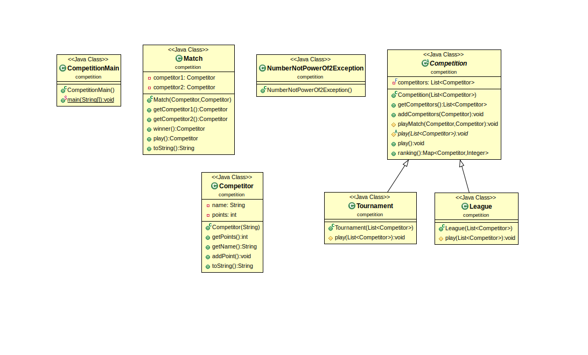
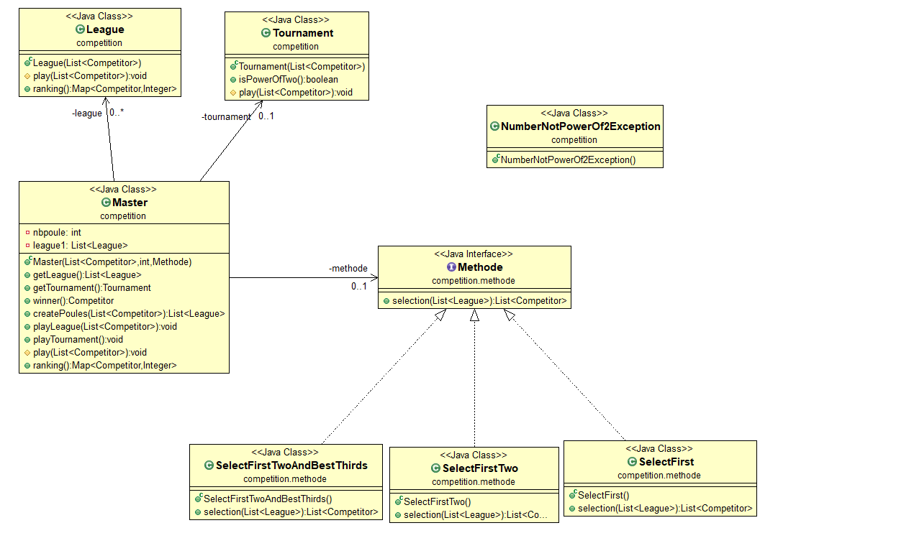
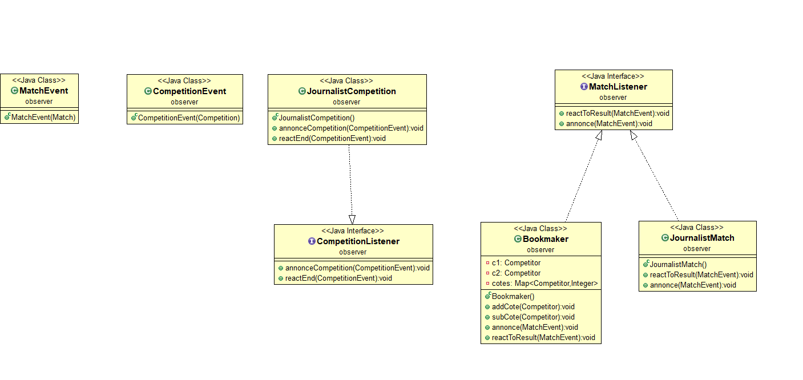

Author : *MUAKA NSILULU Joel & Diakite Aboubakar Siriki*
----------------------------------------------------------------

Projet : *COMPETITIONS SPORTIVES V3*
-------------------------------------

*Remarques sur la V2*
----------------------

- (Readme) Manque des éléments de conception, notamment sur comment ajouter de nouvelles Stratégies. 
- (Readme) Manque d'un (ou plusieurs) diagramme(s) UML de la conception.
- (Master) Possibilité d'avoir un attribut spécifique pour le tournoi final.
- (Master) Création d'une méthode de création des poules.
- (Master) Absence de ranking()
- Test qui vérifie que la méthode de sélection de la stratégie est bien appelée par play()
- Tester l'enchainement poules -> sélection -> tournoi final

Pour la V3, nous avons tenu compte de chacune de ces remarques et nous avons apporté des amélioration par rapport à ça.

*Présentation du projet V3*
-----------------------------

Le projet `COMPETITIONS SPORTIVES V3` est une version améliorée de la version 1 et 2.

Dans les versions précédentes, on avait le choix entre trois types de compétitions :

- Championnat (League)
- Tournois (Tournament)
- Master

Dans cette version, s'ajoute à la version précédente, la possibilité d'intégrer des journalistes ainsi que des bookmakers dans la compétition.

Les journalistes assistent aux compétitions et affichent les résultats pour chaque matchs. Les bookmakers, quant à eux, font évoluer les cotes des compétiteurs en fonction des résultats des matchs de la compétition. Ils maintiennent une liste des cotes des compétiteurs qu’ils affichent et font évoluer en fonction des victoires (diminution de la cote) et des défaites (augmentation de la cote).

*Pour commencer*
------------------

On ouvre un terminal et on se place dans le dossier où l'on veut copier le projet puis on exécute la commande :

		git clone https://gitlab-etu.fil.univ-lille1.fr/muakansilulu/muaka_nsilulu_joel-diakite_siriki_aboubakar-coo.git

*Génération de la documentation*
-------------------------------

Pour générer la documentation du *package competition*, on se place dans la racine du projet, on crée le dossier docs en executant la commande suivante:
		mkdir docs
Puis on se place dans le dossier src et on exécute:
		javadoc competition competition.methode observer -d ../docs

*Consultation de la documentation*
-----------------------------------

Pour consulter la documentation, on se place dans le dossier docs et on ouvre le fichier index.html dans un navigateur.

*Compiler les sources du projet*
----------------------------------

Pour compiler toutes les sources du projets et placer les fichiers .class dans le dossier classes, on se place dans le dossier src et on exécute la commande suivante:

		javac competition/*.java competition/methode/*.java util/MapUtil.java io/*.java observer/*.java -d ../classes
Ensuite pour les compiler dans le dossier courant, on exécute :
		javac competition/*.java competition/methode/*.java util/MapUtil.java io/*.java observer/*.java

# REMARQUE :

`Les tests sont les mêmes pour que pour la V2.` Raison pour laquelle, tout ce qui concerne les testes pour ce rendu est pareil que pour la V2.

*Compiler les tests*
----------------------

On se place dans la racine du projet avec l'existance du dossier classes puis on exécute à tour de rôle les deux commandes (pour compiler les tests respectivement dans le dossier classes et le dossier tests) :

		javac -d classes/ -cp test-1.7.jar:class -sourcepath src:test test/competition/*.java
		javac -cp test-1.7.jar:class -sourcepath src:test test/competition/*.java

*Exécution des tests*
-----------------------

Pour exécuter les tests, après les avoir compiler, on se place dans la racine du projet puis on exécute les commandes suivantes :

Pour Competitor :

		java -jar test-1.7.jar competition.CompetitorTest

Pour Match :

                java -jar test-1.7.jar competition.MatchTest

Pour Tournament :

		java -jar test-1.7.jar competition.TournamentTest

Pour League :

		java -jar test-1.7.jar competition.LeagueTest

Pour Master :

		java -jar test-1.7.jar competition.MasterTest

Pour la méthode SelectFirst :

		java -jar test-1.7.jar competition.SelectFirstTest

Pour la méthode SelectFirstTwo

		java -jar test-1.7.jar competition.SelectFirstTwoTest

Pour la méthode SelectFirstTwoAndBestThirds

		java -jar test-1.7.jar competition.SelectFirstTwoAndBestThirdsTest

*Exécution du programme sans le jar exécutable*
------------------------------------------------

Pour exécuter le programme sans le fichier jar, après avoir compiler toutes les sources du projet, on se place dans src, et on exécute :

		java observer.MainObserver

*Génération du fichier .jar*
-----------------------------
Pour générer le fichier .jar, on se place dans le dossier classes puis on exécute :

		jar cvfm ../MainObserver.jar ../manifestO competition util io observer

*Exécution du programme avec le jar exécutable*
------------------------------------------------
Pour exécuter le programme avec le jar exécutable, on se place dans la racine du projet et on exécute :

		java -jar MainObserver.jar

