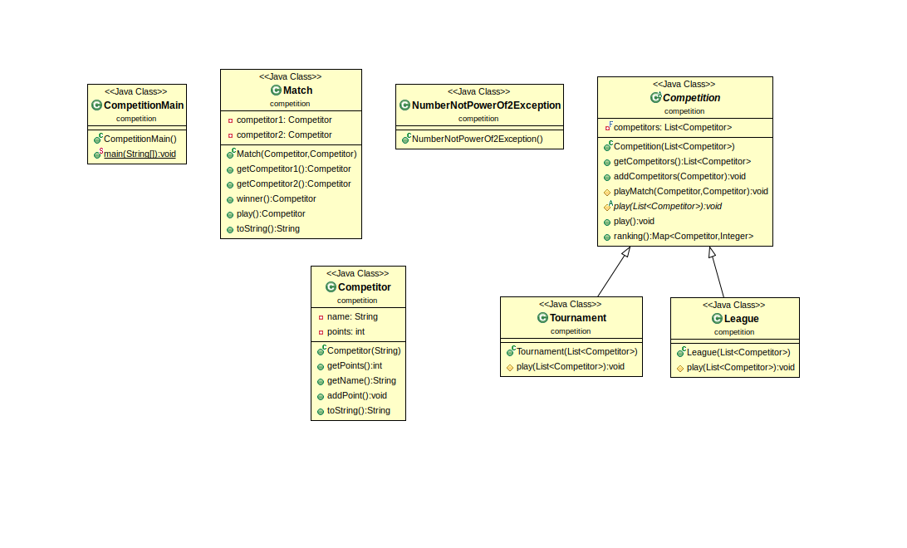

Author : *MUAKA NSILULU Joel & Diakite Aboubakar Siriki *
----------------------------------------------------------------

Projet : *COMPETITIONS SPORTIVES*
-------------------------------------

*Présentation du projet*
-----------------------

Ce TP consiste en la création d'une compétition qui peut être soit un championnat (League) soit un tournois (Tournament) opposant une liste des compétiteurs entre eux selon que la compétition est un championnat ou un tournois.
Les championnats (League) se jouent en matchs aller/retour. Chaque compétiteur rencontre donc 2 fois chacun des autres compétiteurs du championnat. A l’issue du championnat, le vainqueur est donc le compétiteur ayant cumulé le plus grand nombre de victoires.
Les tournois (Tournament) à élimination directe se déroulent sur plusieurs tours. Seuls les compétiteurs ayant gagné leur match lors d’un tour participent au tour suivant.  Les vainqueurs de chaque match se rencontrent ainsi entre eux jusqu’à ce qu’il n’en reste plus qu’un,  déclaré alors vainqueur du tournoi. Ce dernier a donc obtenu autant de victoires que le nombre de tours joués. L’organisation de tels tournois nécessite un nombre de compétiteurs puissance de 2.

*Pour commencer*
------------------

On ouvre un terminal et on se place dans le dossier où l'on veut copier le projet puis on exécute la commande :

		git clone https://gitlab-etu.fil.univ-lille1.fr/muakansilulu/muaka_nsilulu_joel-diakite_siriki_aboubakar-coo.git

Le dossier tp1 est considéré maintenant comme étant la racine du projet.

*Génération de la documentation*
-------------------------------

Pour générer la documentation du *package competition*, on se place dans la racine du projet, on crée le dossier docs en executant la commande suivante:
		mkdir docs
Puis on se place dans le dossier src et on exécute:
		javadoc competition -d ../docs

*Consultation de la documentation*
-----------------------------------

Pour consulter la documentation, on se place dans le dossier docs et on ouvre le fichier index.html dans un navigateur.

*Compiler les sources du projet*
----------------------------------

Pour compiler toutes les sources du projets et placer les fichiers .class dans le dossier classes, on se place dans le dossier src et on exécute la commande suivante:

		javac competition/*.java util/MapUtil.java -d ../classes
Ensuite pour les compiler dans le dossier courant, on exécute :
		javac competition/*.java util/MapUtil.java

*Compiler les tests*
----------------------

On se place dans la racine du projet avec l'existance du dossier classes puis on exécute à tour de rôle les deux commandes (pour compiler les tests respectivement dans le dossier classes et le dossier tests) :

		javac -d classes/ -cp test-1.7.jar:class -sourcepath src:test test/competition/*.java
		javac -cp test-1.7.jar:class -sourcepath src:test test/competition/*.java

*Exécution des tests*
-----------------------

Pour exécuter les tests, après les avoir compiler, on se place dans la racine du projet puis on exécute :
Puis,placez-vous à la racine du projet dans uin terminal.
Exécuter la commande suivante:

Pour Competitor :

		java -jar test-1.7.jar competition.CompetitorTest

Pour Match :

                java -jar test-1.7.jar competition.MatchTest

Pour Tournament :

		java -jar test-1.7.jar competition.TournamentTest

Pour League :

		java -jar test-1.7.jar competition.LeagueTest

*Exécution du programme sans le jar exécutable*
------------------------------------------------

Pour exécuter le programme sans le fichier jar, après avoir compiler toutes les sources du projet, on se place dans src, et on exécute la comande :

		java competition.CompetitionMain

*Génération du fichier .jar*
-----------------------------
Pour générer le fichier .jar, on se place dans le dossier classes puis on exécute la commande suivante

		
		jar cvfm ../Competition.jar ../manifest competition util

*Exécution du programme avec le jar exécutable*
------------------------------------------------
Pour exécuter le programme avec le jar exécutable, on se place dans la racine du projet et on exécute la commande :

		java -jar Competition.jar

*Diagramme de classes UML*
---------------------------

Voici les diagrammes UML du projet :

